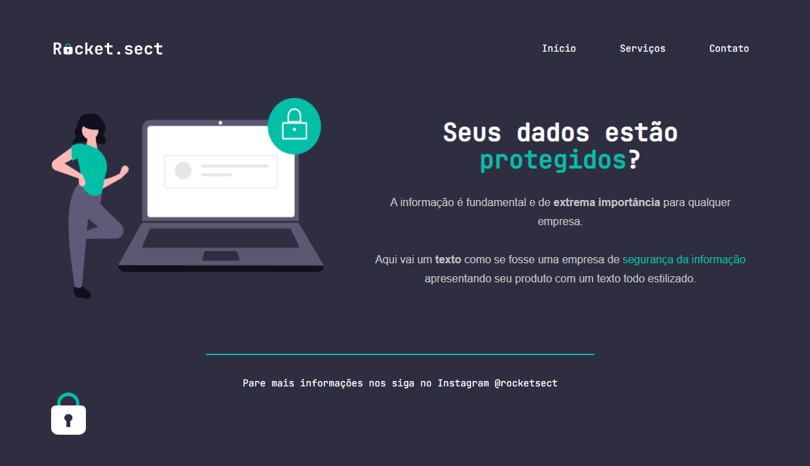

# Rocket.sect

# Sobre o projeto / About the project

Neste projeto foi criado uma página para reforçar os conceitos de html e CSS.

This project involved creating a page to reinforce HTML and CSS skills.

## Assuntos abordados neste desafio

- Estrutura HTML com tags semânticas / HTML structure with semantic tags
- Conceito box Model, flexbox e botões / Box Model, flexbox and buttons concepts
- Ferramenta DevTools do navegador / Browser devtools

## Layout

# Tecnologias utilizadas / Tech stack
- HTML
- CSS
- Figma
- Git e Github

## Autor

